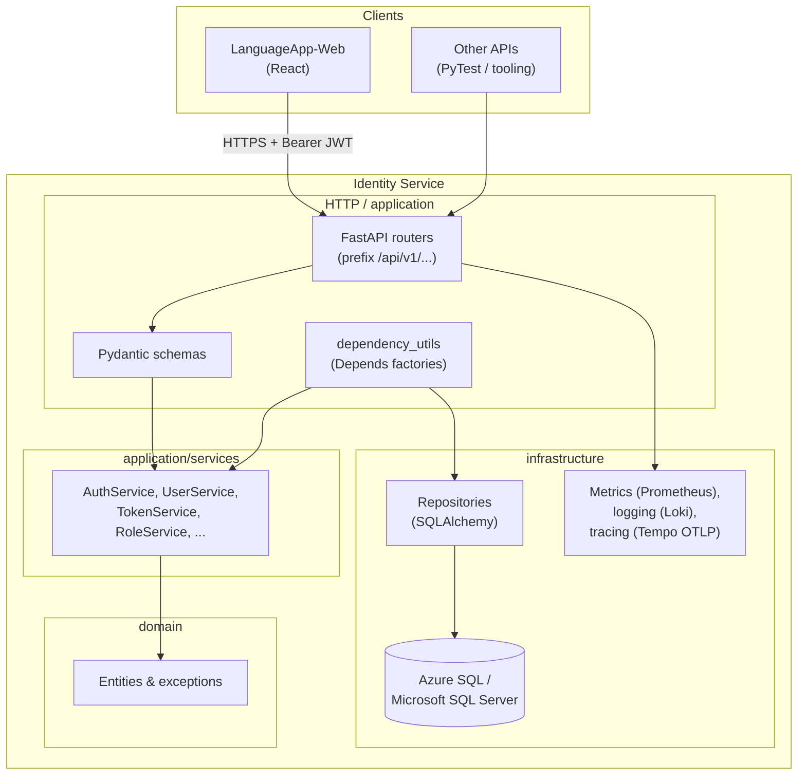

# LanguageApp Identity Service

Backend API responsible for **authentication**, **user directory**, **roles**, **permissions**, **service catalog**, and **user–service assignments** for the LanguageApp platform.


It exposes a **FastAPI** application designed to run beside other microservices. The **React** front end (`LanguageApp-Web`) and consumer services rely on JWT access tokens minted here (shared signing key).
=======
## CI/CD and Docker

Docker images are built and pushed to **Docker Hub** by GitHub Actions when you push a **tag**. The environment (Prod vs Test) is determined by **which branch contains the tag’s commit**:

- **Tag’s commit on `main`** → **Prod** image is built and pushed (image tag + `latest`).
- **Tag’s commit on `test`** → **Test** image is built and pushed (image tag only).
- If the commit is on both branches, **Prod** is used (main takes precedence). If on neither, the workflow is skipped.

### GitHub secrets (required)

In the repo **Settings → Secrets and variables → Actions**, add:

- **`DOCKERHUB_USERNAME`** – your Docker Hub username.
- **`DOCKERHUB_TOKEN`** – a Docker Hub access token (Account → Security → New Access Token, Read & Write).

### Docker Hub and workflow config

- Create a repository on Docker Hub (e.g. `languageapp-identity`). The workflow uses the repo name set in [.github/workflows/build-and-push-docker.yml](.github/workflows/build-and-push-docker.yml) (`DOCKER_IMAGE_REPO`); change it if your repo name differs.
- After a tag push, the image is available as `$DOCKERHUB_USERNAME/$DOCKER_IMAGE_REPO:<tag>` (and `:latest` for Prod).

### Azure Web Apps

- **Prod:** Use image `youruser/languageapp-identity:latest` or a specific tag (e.g. `:v1.0.0`).
- **Test:** Use image `youruser/languageapp-identity:<test-tag>` (e.g. a tag pushed from the `test` branch).

See **Azure Web App** below for required app settings and port.

## Documentation
- For database drivers, connection strings, async runtime details, and environment variables see [databases/README.md](databases/README.md).


---

## Architecture

Identity follows a **layered (hexagonal-inspired) layout**: HTTP concerns stay in routers and Pydantic schemas; business rules live in services; persistence is isolated in repositories; SQLAlchemy models sit in infrastructure.



**Request flow**

1. Routes receive DTOs (Pydantic), resolve dependencies (`Depends`): async DB session, repositories, then services.
2. **TokenService** builds JWT payloads with **`roles`: service name → list of role names** (consumers authorize by service slice).
3. **Repositories** translate between domain entities and `infrastructure.databases.models`.

---

## Patterns in this codebase

| Area | Pattern |
| --- | --- |
| **API surface** | `APIRouter` per domain (`application/routers/*_router.py`). Central **prefix/tag** conventions (e.g. auth under `/api/v1/auth`). |
| **Validation** | Pydantic v2 **`BaseModel`** request/response schemas under `application/schemas/`. **`field_validator`** for cross-field checks (password strength delegates to **`core.password_validator`**). |
| **Composition** | **`application/routers/dependency_utils.py`** — `Annotated[..., Depends(...)]` aliases for **`UserSvcDep`**, **`TokenSvcDep`**, **`require_role`** / **`require_permission`**, **OAuth2 Bearer** extraction. Keeps routers thin. |
| **Persistence** | **Repository** classes implement interfaces under `domain/interfaces/` and use **async SQLAlchemy** sessions injected per request (**`get_monitored_db_session`**). |
| **Security** | **Passlib bcrypt** hashing via **`core.security`**. **JWT** (PyJWT) for access tokens. Config from **`core.settings`** (`pydantic-settings`). |
| **Cross-cutting** | Decorators under `infrastructure.observability/*` attach **metrics**, **structured logging**, **OpenTelemetry spans** around auth/password/token/database operations. |

---

## Prerequisites

- **Python** 3.11+ recommended (matches typical CI; 3.13+ works locally).
- **Microsoft SQL Server** or **Azure SQL** reachable from this host.
- **ODBC Driver 18 for SQL Server** installed (URLs in `.env_template` assume `ODBC Driver 18 for SQL Server`).
- For async runtime URLs, **`aioodbc`** is used (**`mssql+aioodbc://...`**). Migrations commonly use **`mssql+pyodbc://...`** (sync Alembic engine).

Optional: **Docker**/`sqlcmd`/`az` tooling if you automate database creation externally.

---

## Configuration

Copy **`.env_template`** (or compose your own) to **`.env`**. **`load_dotenv()`** in **`main.py`** loads it before settings are instantiated.

**Required variables** (see **`core/settings.py`** for full list): `SECRET_TOKEN_KEY` (≥ 32 chars), `AUTH_ALGORITHM`, `TOKEN_TIME_DELTA_IN_MINUTES`, `IDENTITY_DATABASE_URL`, `IDENTITY_DATABASE_MIGRATION_URL`, `DEFAULT_USER_ROLE`, `TOKEN_URL`, `SERVICE_ID`.

The project also resolves Azure App Service **`SQLCONNSTR_*`** / **`SQLAZURECONNSTR_*`** naming for database URLs where applicable (**`Settings.read_azure_connection_strings`**).

---

## Database setup and migrations

1. Create an empty SQL Server database and two logins/users if you separate app vs migration DDL (recommended for production).

2. Set **`IDENTITY_DATABASE_URL`** (app, async **`aioodbc`**) and **`IDENTITY_DATABASE_MIGRATION_URL`** (sync **`pyodbc`**) per **`.env_template`**.

3. From the repo root:

   ```bash
   alembic upgrade head
   ```

Alembic reads **`IDENTITY_DATABASE_MIGRATION_URL`** via **`infrastructure.databases.database`** (see **`alembic/env.py`**). Autogenerated schema lives under **`alembic/versions/`**.

---

## Run the HTTP API locally

Install dependencies:

```bash
python -m venv .venv
.venv\Scripts\activate
python -m pip install -r requirements.txt
```

Start Uvicorn (example port **8000**):

```bash
uvicorn main:app --reload --host 127.0.0.1 --port 8000
```

Interactive docs:

- **Swagger UI:** `http://127.0.0.1:8000/docs`

---

## Automated tests

The suite uses **PyTest** (**`pytest`**, **`pytest-asyncio`**) configured in **`pytest.ini`** and **`tests/`**.

```bash
python -m pip install -r requirements.txt
python -m pytest tests -v
```

**Note:** `tests/conftest.py` stubs **`infrastructure.databases.database`** at import time so isolated tests do **not** require a running SQL Server or Alembic. Full integration tests against a database are not part of this default suite.

---

## Observability (optional)

Controlled by **`LOKI_*`**, **`METRICS_*`**, **`TRACING_*`**, **`TEMPO_*`** (see **`core/settings.py`**). When enabled, Prometheus metrics are exposed (**`instrumentator`**), Loki pushes structured logs, and traces export OTLP (**Tempo**).

---

## Related repositories

| Project | Role |
| --- | --- |
| **`LanguageApp-Web`** | SPA; calls Identity OAuth2 token and admin APIs |
| **`LanguageApp-PhrasalVerbsSvc`** | Consumer API; verifies JWT issued by Identity (**same signing key**) |
| **`LanguageApp-PrepositionsSvc`** | Consumer API for prepositions / function-word practice; **`SERVICE_NAME`** must match the `services.name` row (e.g. `prepositions-service`) so JWT `roles` resolve correctly |

RBAC for Prepositions is seeded by Alembic revision `20260428_0002_seed_prepositions_service` (roles `prepositions-user`, `admin`). For manual SQL Server setup, see [scripts/seed_prepositions_service.sql](scripts/seed_prepositions_service.sql).
